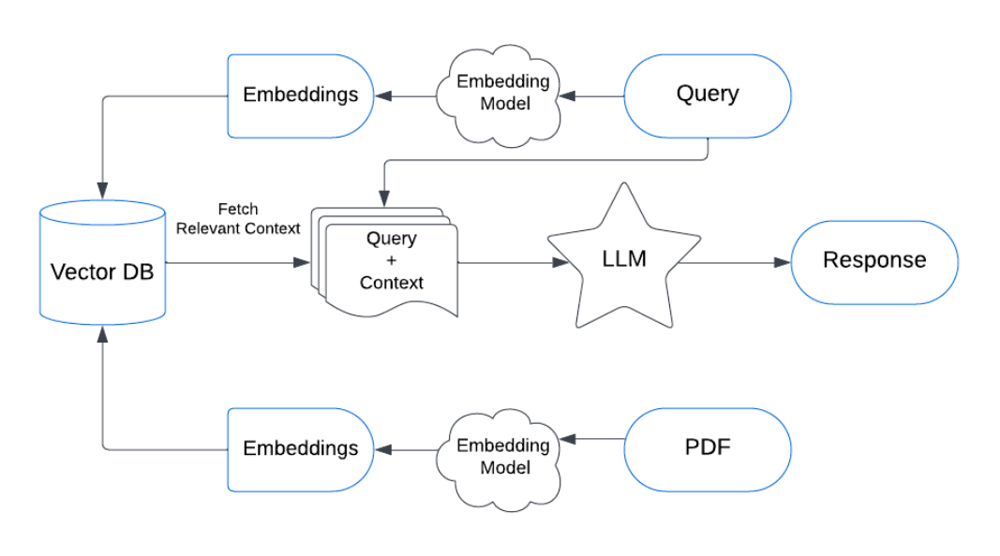
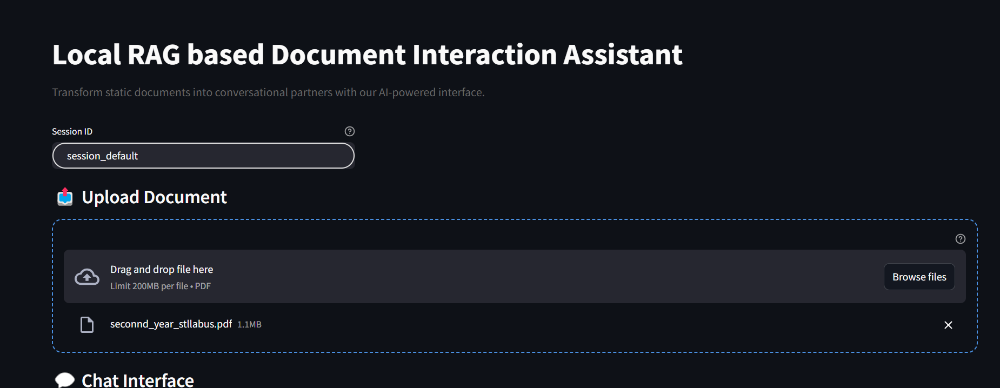

# DocuChat-Local: Private Document Analysis Assistant

[](https://streamlit.io/)
[](https://ollama.ai/)

A local RAG application for secure document interactions without cloud dependencies.

---

## Project Focus
- Local processing of sensitive documents
- Complete offline capability
- Private conversation history
- CPU-only operation support
- **History and Context Awareness**: Maintains conversation context for seamless interactions

---

## Key Features
- **Local Language Model**: Runs entirely on your hardware
- **Document Privacy**: No data leaves your machine
- **Context-Aware Chat**: Understands conversation flow
- **Secure Processing**: Full data lifecycle management
- **History-Aware Conversations**: Remembers previous interactions for contextually accurate responses

---

## Technical Architecture

### Core Components
- **Frontend**: Streamlit
- **LLM**: Ollama (local models)
- **Vector Database**: FAISS
- **Embeddings**: HuggingFace (all-MiniLM-L6-v2)
- **Framework**: LangChain
- **Memory Management**: Session-based conversation history


  ## Run Locally

  Clone the project

  ```bash
    git clone https://github.com/uzairsayyed-005/DocuChat_AI

  ```

  Go to the project directory


  Install dependencies

  ```bash
    pip install -r requirements.txt

  ```

  Start the server

  ```bash
    streamlit run app.py

  ```
  ## RAG-Diagram

  

  ## Application interface

  

  ##  Contributors

  - **Uzair Sayyed** – [GitHub Profile](https://github.com/uzairsayyed-005)  # DocuChat-Local: Private Document Analysis Assistant

[](https://streamlit.io/)
[](https://ollama.ai/)

A local RAG application for secure document interactions without cloud dependencies.

---

## Project Focus
- Local processing of sensitive documents
- Complete offline capability
- Private conversation history
- CPU-only operation support
- **History and Context Awareness**: Maintains conversation context for seamless interactions

---

## Key Features
- **Local Language Model**: Runs entirely on your hardware
- **Document Privacy**: No data leaves your machine
- **Context-Aware Chat**: Understands conversation flow
- **Secure Processing**: Full data lifecycle management
- **History-Aware Conversations**: Remembers previous interactions for contextually accurate responses

---

## Technical Architecture

### Core Components
- **Frontend**: Streamlit
- **LLM**: Ollama (local models)
- **Vector Database**: FAISS
- **Embeddings**: HuggingFace (all-MiniLM-L6-v2)
- **Framework**: LangChain
- **Memory Management**: Session-based conversation history


  ## Run Locally

  Clone the project

  ```bash
    git clone https://github.com/uzairsayyed-005/DocuChat_AI

  ```

  Go to the project directory


  Install dependencies

  ```bash
    pip install -r requirements.txt

  ```

  Start the server

  ```bash
    streamlit run app.py

  ```
  ## RAG-Diagram

  

  ## Application interface

  

  ##  Contributors

  - **Uzair Sayyed** – [GitHub Profile](https://github.com/uzairsayyed-005)  
